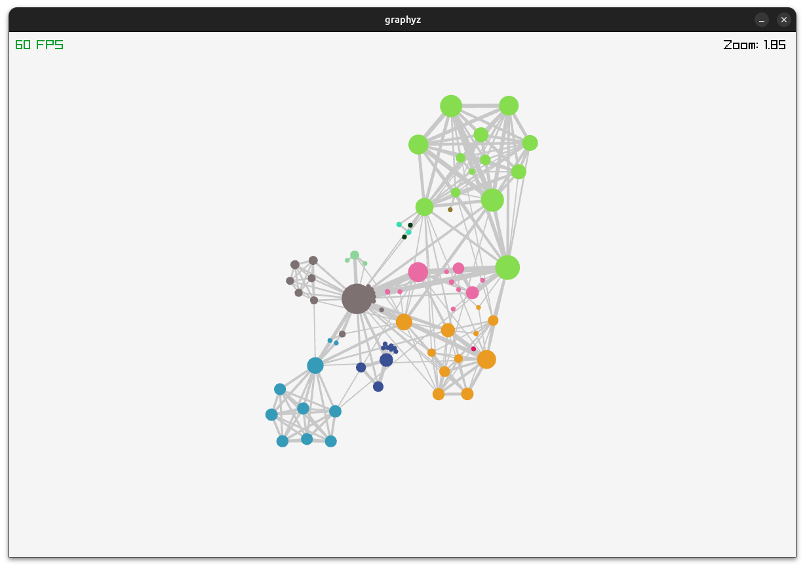

# Graphyz

A simple program for interactive real-time force directed graph layout simulation written with Go and Raylib. Loosely based on the Fruchterman-Reingold algorithm, d3-force, and force atlas 2. Uses the Barnes-Hut algorithm to optimize force calculations.

Work in progress.

## Example



## Usage

Launch Graphyz from the console:

```console
./graphyz "path/to/you/graph.json"
```

It currently only accepts graphs in json format with the fields "nodes" and "links". The "nodes" field is an array of nodes which may contain the "name" and "group" fields that determine what is displayed on hover and the color of the nodes, respectively. The "links" field must contain a "source" and a "target" field that have the indices of the respective nodes in the nodes array. Each link can optionally have a "value" field that acts as an edge weight.

Here is a minimal example:

```javascript
{
    "nodes": [{"name": "John Smith", "group": 0},{"name": "Jane Doe", "group": 1}],
    "links": [{"source": 0, "target": 1, "value": 5}]
}
```

## References
- Force-directed graph layouts: https://en.wikipedia.org/wiki/Force-directed_graph_drawing
- d3-force: https://github.com/d3/d3-force
- Force atlas 2: https://journals.plos.org/plosone/article?id=10.1371/journal.pone.0098679
- Go bindings for Raylib: https://github.com/gen2brain/raylib-go 
- Fruchterman-Reingold paper: https://www.mathe2.uni-bayreuth.de/axel/papers/reingold:graph_drawing_by_force_directed_placement.pdf

## To-do
- Use GPU instancing to speed up rendering for large graphs
- Add support for additional graph serialization formats
- Hot reloading of graphs
